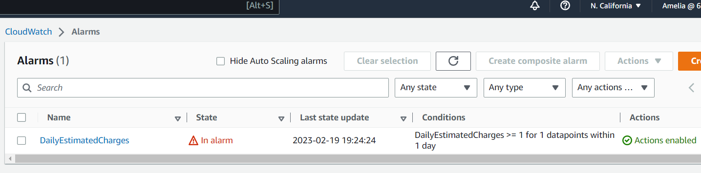

# Week 0 — Billing and Architecture

## Required Homework

### Install AWS CLI

## Homework Challenges

### Create Billing Alarm

I created a Billing Alarm in CloudWatch. The Alarm has an "In alarm" warning.

### Create Budget Alarm

I created one budget via the AWS Console and another via the AWS CLI in Gitpod.

