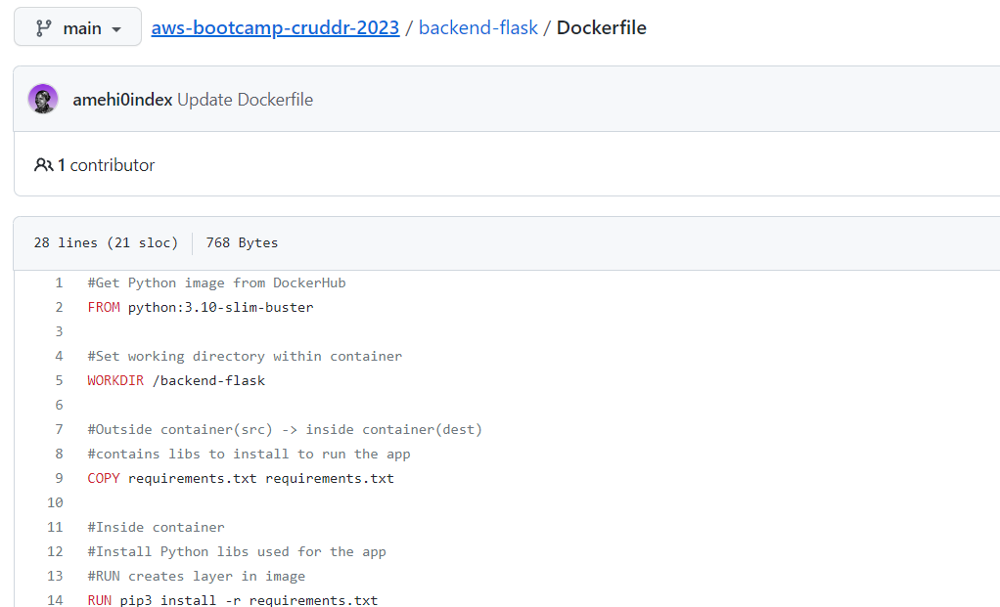
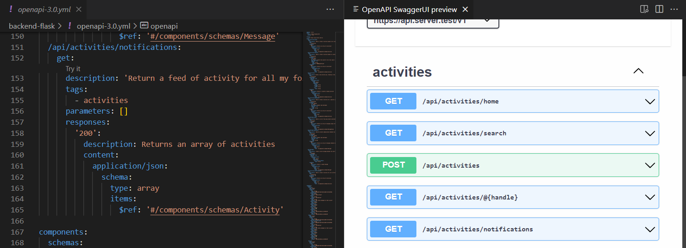
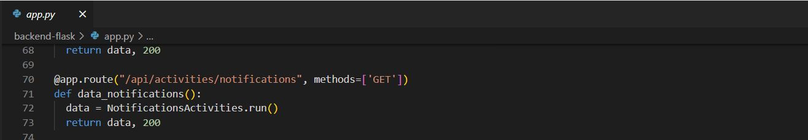
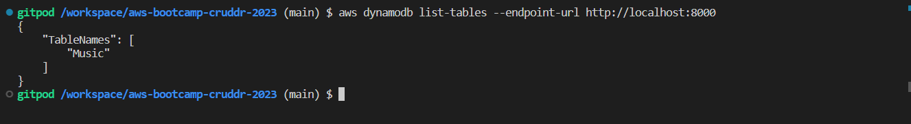
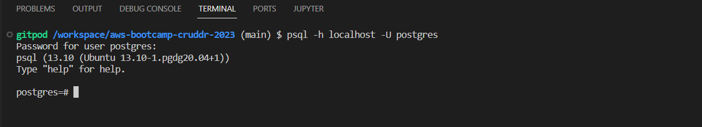

# Week 1 — App Containerization

## Containerize Application 

### Add Dockerfile for Backend: [Backend Dockerfile](/backend-flask/Dockerfile)




## 	Document the Notification Endpoint for the OpenAI Document




## Write a Flask Backend Endpoint for Notifications

Code found [here](/backend-flask/app.py)




## Write a React Page for Notifications

Code found [here](/frontend-react-js/src/pages/NotificationsFeedPage.js)


## Run DynamoDB Local Container and ensure it workstable

Create a table from example found [here](https://github.com/100DaysOfCloud/challenge-dynamodb-local)



## Run Postgres Container and ensure it works

From terminal, run the command: 
```
psql -h localhost -U postgres

```



