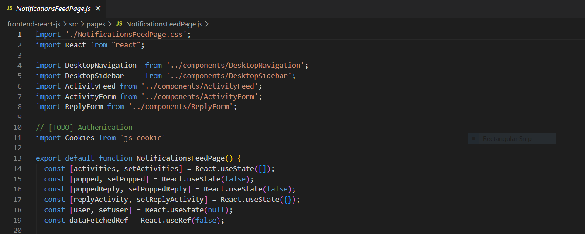

# Week 1 — App Containerization

## Containerize Application 

### Add Dockerfile for Backend: [Backend Dockerfile](/backend-flask/Dockerfile)


## 	Document the Notification Endpoint for the OpenAI Document


## Write a Flask Backend Endpoint for Notifications

Code found [here](/backend-flask/app.py)


## Write a React Page for Notifications

Code found [here](/frontend-react-js/src/pages/NotificationsFeedPage.js)



## Run DynamoDB Local Container and ensure it workstable

Create a table from example found [here](https://github.com/100DaysOfCloud/challenge-dynamodb-local)


## Run Postgres Container and ensure it works

From terminal, run the command: 
```
psql -h localhost -U postgres
```


## Stretch Assignments

### Push and tag an image to Docker Hub

As a stretch assignment, I pushed and tagged an image to Docker Hub found [here](https://hub.docker.com/repository/docker/amehi4yus/reactquiz/general)


### Learn how to install Docker on your localmachine and run the containers
- Download, install and run Docker Desktop : https://hub.docker.com/
- Downloaded zip file found [here](https://github.com/amehi0index/aws-bootcamp-cruddr-2023)
- Deleted meta.json file from path as explained here : 
	https://stackoverflow.com/questions/74804296/docker-endpoint-for-default-not-found
- cd into fontend-react-js: npm install 
- rt click on docker-compose.yml, select Compose Up


